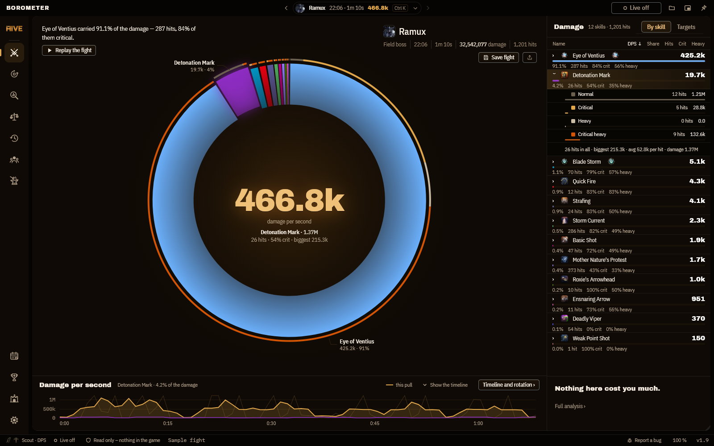
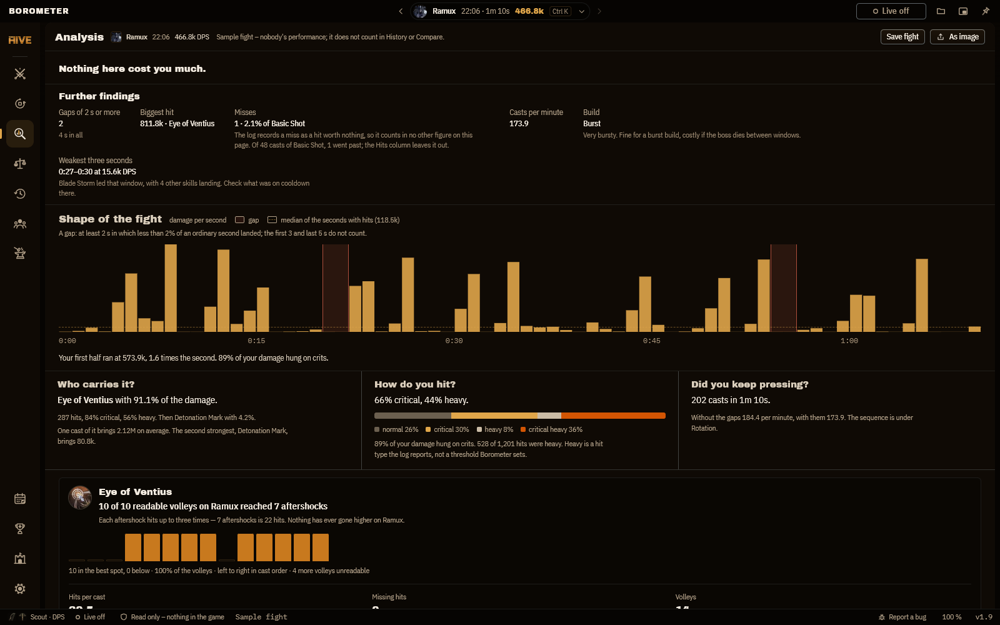
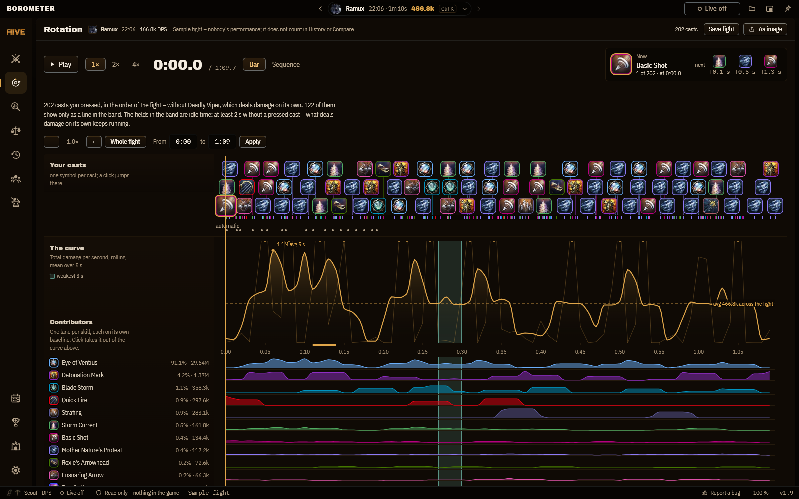
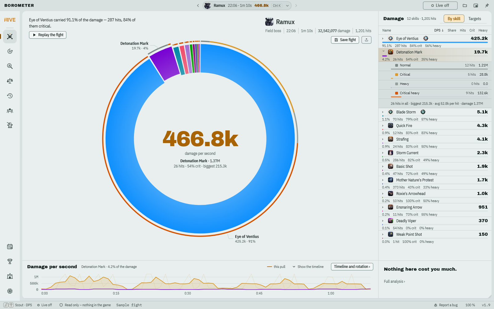
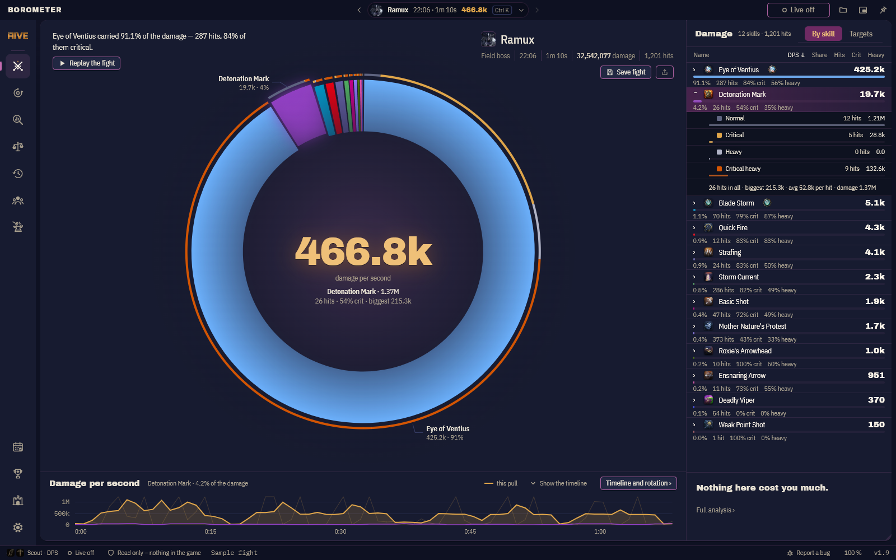
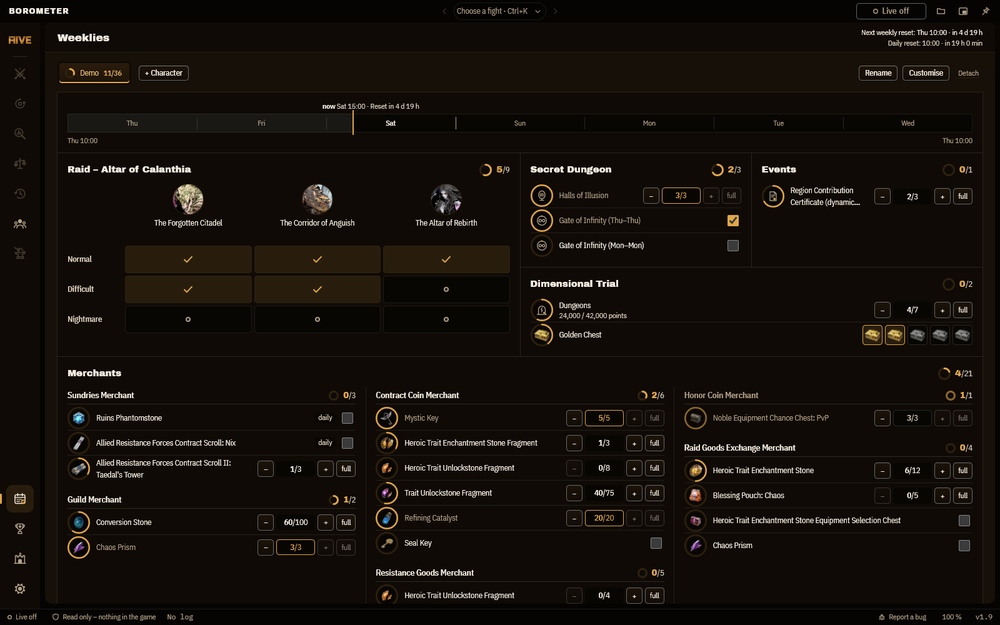
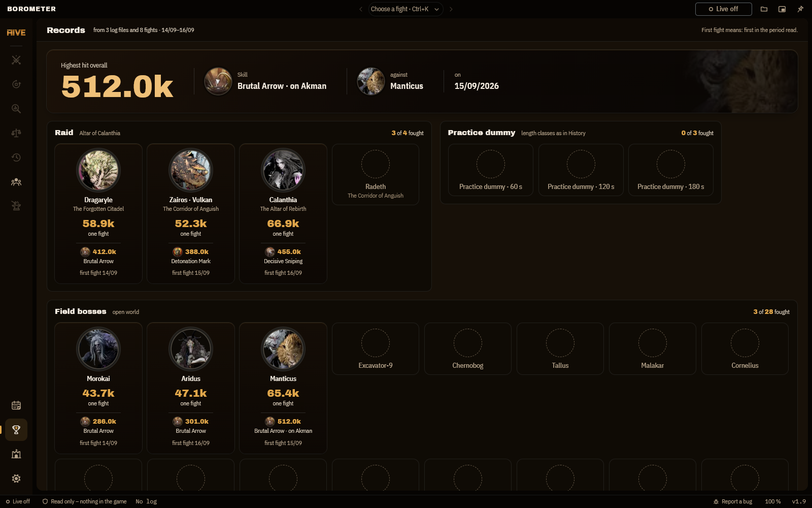

Hey,this app is completely AI generated. The only thing what i did was telling him what to create and to fix because AI is dumb as me. It works fine. I did tell him exactly what it should do, like your mum telling you to clean finally your room. Have fun! :-)

# Borometer

A DPS meter for **Throne and Liberty**. It reads the combat log file that the
game itself writes to disk, and nothing else. It has no access to the game
process, needs no account, sends no telemetry and makes no outbound network
call of its own.

> **Fan project.** Not affiliated with NCSOFT or Amazon Games, and not endorsed or
> reviewed by them. Throne and Liberty is a trademark of NCSOFT. Borometer is free,
> with no ads and no donations. Game images belong to their owner and are not
> covered by the GPL. The release builds embed them, the source code has none, and
> the screenshots on this page show a release build.

**[Download the latest version](https://github.com/B0R0AK/Borometer/releases/latest)**
as an installer, or as a portable exe that runs anywhere without installing.

*[Deutsche Fassung: README.de.md](README.de.md)*

The selected fight is drawn as a ring. Each arc is one skill, sized by its
damage, and the big number sits in the middle. Above the ring stand the facts
of the fight and **one sentence that reads it**: which skill carried it,
whether the target was out of reach for a while, or that there were too few
hits to say anything at all. Known bosses carry their portrait beside the name.

To the right of the ring, the skills are listed by damage with share, hits and
the rates for critical and heavy. Click an arc and the list opens that skill
with its hit types. In a party fight
the ring shows the members instead. **Replay the fight** runs the skills
against each other as a race, their bars growing with the damage dealt so far.

The fights themselves sit in the picker in the middle of the title bar
(Ctrl + K), grouped into dungeon runs and named by their boss.

> The [feature guide](GUIDE.en.md) has everything in order: every tab, every
> button, the keyboard shortcuts and the arithmetic behind them.

*(The screenshots show the app in English. Every label exists in German too.
You switch the language in the More menu (···) in the top bar, or under
Settings › Language.)*

---

## Every row opens up

Click a skill to see how its damage came about. Normal, critical, heavy and
critical heavy hits each get their own bar, hit count and damage, and below
them stand the total hits, the biggest hit and the average per hit. In Compact
the hit types also show their share of the skill's damage, and heavy ones
carry a `×2`, because a heavy hit deals double damage.

## What the fight gives away

The analysis puts into sentences what the numbers say: how bursty the damage
was, where the weakest three seconds sat, how much idle time stood between
them, how many attacks missed, and for Eye of Ventius, how many of your
volleys reached as many aftershocks as your best one. How many aftershocks a
target gives at all depends on its size, so the ceiling is set per boss in a
table instead of being fixed.

## When you used what

One icon per cast, one trace per skill. Gaps in the rotation show up here
faster than in any table. Ctrl + scroll zooms in, the bar drags the window,
and the keyboard does the same.

## Two fights side by side

Tick two to four fights, from the loaded log or from what you saved.
Borometer says who wins and where the difference comes from (usually two or
three skills carry nearly all of it), and puts the figures directly against
each other. If the fights are different lengths, it says so and offers to cut
both to the shorter one. Without the cut you would be comparing totals that
are only bigger because the fight ran longer.

## Four themes

Dark, light, a third in the game's own colours, and smoked glass, which on
Windows 11 lets what is behind the window show through, blurred. Contrast is
measured in all four. Borometer takes the setting from Windows, or you pick
one.

## Weekly tasks

One tab per character: the raid as a grid of wings and difficulties, the
secret dungeon, events, the dimensional trial and the merchants, each with
its counter. A band shows where the week stands and when the next weekly and
daily reset comes. Nothing here is read from the game; you tick it off
yourself.

## Records

Borometer reads your logs once and keeps an album: for every boss your best
DPS, your strongest hit with the skill that landed it, and the day of your
first fight. Bosses you have not fought yet stand as empty outlines.

## Compact

For a second monitor, or laid over the game: the readout and the bars, nothing
else. The window can be made see-through, in whole steps from 0 to 55 %, and
kept on top of everything. **Esc** takes you back.

---

## Getting started

### 1. Turn on combat logging in game

    Settings → Shortcuts → Ring Menu → add "Combat Meter"

Then activate it once from the ring menu. From then on the game writes a file
at the end of every fight.

### 2. Get Borometer

**Download it ready-made.** Every version under
[Releases](https://github.com/B0R0AK/Borometer/releases/latest) has three
files. All three are the same app, packed differently:

| File | What it is |
|---|---|
| `Borometer-Setup-<version>.exe` | **Installer.** Adds Start menu and desktop shortcuts, uninstalls from Windows settings. Saved fights go to `Documents\Borometer`. |
| `Borometer-<version>-portable.exe` | **Portable, one file.** Nothing to install, just run it, from a USB stick if you like. What you save lands next to the exe. |
| `Borometer-<version>-win-x64.zip` | **Portable, as a folder.** As above, unpacked: unzip, run `Borometer.exe`. See below for why it exists. |

All three share the same settings (see below), so you can switch at any time,
including from an older Python build.

**Or build it yourself**, if you would rather trust the source than a
ready-made binary:

1. Install [Node.js](https://nodejs.org/) 22 or newer.
2. Run `npm ci` in the source folder. It fetches Electron, TypeScript and the
   build tools.
3. `npm run dist:win` builds all three files into `release\`. To just try it
   without packaging: `npm start`.

A build of your own shows Borometer's drawn marks where the downloads show game
images ([Building from source](#building-from-source)).

### 3. Run it

Borometer finds the log folder at `%LOCALAPPDATA%\TL\Saved\CombatLogs` by
itself. It does not start watching until you press **Live off** in the top
bar (on the start page: **Start live logging**). The button then reads
**Live**, and a second click stops it. On its own it never loads anything, not
even a fight already sitting in that folder. From that click on it checks
every two seconds for a newer file, so a pull appears shortly after the fight:
the game writes the log when the fight ends, not during it.

If Borometer cannot work out where the folder is, the landing screen says so
and offers **Choose folder**. Pick it once and it is remembered.

You do not need the exe: `npm start` works from the source, and so does
opening the built `boro-meter.html` (also attached to each release) in a
browser. Everything works that way except the automatic folder watching. In a
browser you either drag the log file in, or click **Live off** and pick the
log folder, which needs Chrome or Edge.

### On first launch

Windows shows a SmartScreen notice saying the publisher is unknown. That
appears for every unsigned program, whatever it does: **More info → Run
anyway**.

Your antivirus may also flag it, most likely the single portable file. That
file unpacks itself into a temp folder at every start, and some scanners read
the self-extraction as suspicious. It is a false positive, but if it gets in
the way, use the installer or the zip. Neither unpacks anything at start, and
heuristics react to them far less often. If a ready-made binary still does not
sit right with you, build it yourself from the same source.

If a scanner flags any of them, the correct fix is to report it to the vendor
as a false positive (Microsoft's form is at
[microsoft.com/wdsi/filesubmission](https://www.microsoft.com/en-us/wdsi/filesubmission)),
not to disable your antivirus.

---

## Party board

Everyone pushes their newest fight, and everyone sees one merged, ranked board
with the build and its role beside each name, such as Oracle · Healer or
Crusader · Tank. Rows open up. Everything for it lives on the *Party* tab.

**If your clan already runs a server**, which is the common case, you enter
its address once: under *Party server*, into the **Server address** field,
then **Save**. After that the four-character code somebody passes around is
all you need. Leave the field empty and Borometer hosts from your own PC
instead.

**Hosted from your own PC.** Type your character name and press **Host a
party**. You get a four-character code plus an address, like
`AB7K@192.168.1.20:8732`. The code uses letters and digits but leaves out 0,
O, 1 and I, so nothing is misheard when read aloud. Everyone else types their
own name, pastes that whole string, and presses **Join with that code**. This
works out of the box for anyone on the same network as the host. Across the
internet the host has to be reachable, which means either a forwarded port or
something like Tailscale that puts you all on one virtual network.

While hosting, Borometer opens a second port that answers party traffic only.
Logs and settings cannot be reached through that port, and it rejects any
request without the current code. Closing the party closes the port.

**Setting up a small server of your own.** Then the party no longer depends on
one particular player's PC staying on and reachable. The server is in
[`BoroPartyServer/`](BoroPartyServer/): a single Python file with no
dependencies beyond the standard library, plus a systemd unit and the setup
guide, [`SELF-HOSTING.md`](BoroPartyServer/SELF-HOSTING.md). It keeps only
what the Borometers push to it, and only in memory: each player's character
name and two weapons; for their latest fight the target, start time and
length, damage, DPS, hits, the crit and heavy figures and the biggest hit; and
for up to twelve skills their names with the same figures, split by hit type,
a damage curve per second and the times of their casts. It never
reads a combat log and talks to nothing except the Borometers that choose to
push to it.

---

## What is in here

| File | What for |
|---|---|
| `src/renderer/` | the interface: `index.html`, `styles.css`, `types.ts`, `main.ts` and in `app/` the page script as numbered ES modules (parser, meter, charts, comparison, party) |
| `src/main/` | the main program in TypeScript: window, log folder, saving, party |
| `scripts/build-renderer.mjs` | bundles the interface with esbuild into one single HTML file |
| `src/renderer/spielbilder.ts` | the tables of game images, empty in this source; the release build fills them |
| `scripts/safety-audit.mjs` | checks mechanically that the app only ever reads ([what it checks](#what-the-audit-checks)) |
| `scripts/audit-negative.mjs` | breaks each audit rule on purpose and checks that the audit notices |
| `electron-builder.yml` | how the installer, portable exe and zip are packed |
| `build/` | the app icon, and the installer's pictures and words (`installer.nsh`; `npm run installer-art` draws the pictures) |
| `CHANGELOG.txt` / `CHANGELOG.de.txt` | what changed in each version |
| `BoroPartyServer/` | the optional party server, with [how to host it](BoroPartyServer/SELF-HOSTING.md) |
| `SECURITY.md` | how to report a security problem privately |
| `CONTRIBUTING.md` | how to help: issues only |

The working repository also runs a screenshot parity test against a fixed
reference; it needs the private history and is not part of this repository.

Settings live in `%APPDATA%\Borometer\boro-config.json`, the same file for the
installer, the portable exe and the zip. An older file next to the exe is
carried over once on first run, so updating is just starting the new version.

What Borometer writes itself (`Logs`, `Party-Logs` and `Bug-Reports`) appears
only the first time you save that kind of file: under `Documents\Borometer`
for the installed version, next to the exe for the portable ones.

---

## When something is wrong

**Write a bug report** sits in the left rail. It drops a JSON file into the
`Bug-Reports` folder (next to the exe, or under `Documents\Borometer` when
installed) with the version, the window size, how the log's columns were read,
which skills and hit types turned up, and what last went wrong.

The combat log itself is not in there. The path to your settings file is,
though, which means your Windows user name, along with the log's file name and
short samples from its columns, which carry character and enemy names. It is
plain text; have a look before you pass it on.

Attach it to an [issue](https://github.com/B0R0AK/Borometer/issues), and the
combat log it happened on if you still have it. With both, almost anything can
be reproduced.

---

## Systems

**Windows 10 and 11 (64-bit)** are the target, and what it is built for.
Borometer brings its own window (Electron, so its own Chromium) and needs
neither WebView2 nor an installed browser.

**Windows 7, 8 and 8.1** are not supported: the Chromium inside no longer runs
there.

**Linux** works too, including under Proton: `npm run dist:linux` builds an
AppImage, or run it straight from the source with `npm start`. Borometer looks
for combat logs both in the normal Windows location and inside Steam's Proton
prefixes. Compact's see-through does not exist on Linux.

**macOS** is untested, and Throne and Liberty does not run there anyway.

---

## What it does not do

Borometer reads the detailed combat log that Throne and Liberty writes when
you switch on the game's own combat logging. It does not inject code, read
game memory, hook the renderer, or send any input to the game. Nothing is
uploaded, and there is no account and no telemetry.

Borometer registers exactly one shortcut with Windows: **Ctrl+Shift+D** for
click-through. Windows tells Borometer when that combination is pressed and
about no other key. Borometer does not read the keyboard.

Network only happens when you switch it on. In normal use the local helper
binds to 127.0.0.1 and calls nothing. Two things change that, each only on
your word. A party: hosting opens a second port to the outside, and joining
sends your figures to the host or to your party server. What travels is your
character name with weapons, role and game language, and your newest fight:
its figures per skill, the damage per second and when you used what. Never a
log file. And the update notice, off by default: switched on, it asks this
repository once per start for its latest release.

`npm run audit:safety` checks these rules mechanically, against the source, on
every change. [What the audit checks](#what-the-audit-checks) lists them.

Even so, nobody can promise you will not be penalised for a third-party tool.
Easy Anti-Cheat is proprietary and Amazon's code of conduct lets them act
against unauthorised tools at their discretion. Reading a log file the game
itself produces sits well outside what anti-cheat is documented to act on, but
the risk is not zero. Keep it to your own numbers.

---

## What the audit checks

`npm run audit:safety` reads the source and fails the build when Borometer could do
more than read the combat log. Among its rules:

- nothing touches the game: no process access, no memory reading, no DLL, no hook,
  no overlay; the game's folder is only ever read;
- the page has no network: it speaks HTTP to `127.0.0.1` only, and every request
  starts at `/api/`;
- the main process goes outside in two places only, and only when you ask for it:
  the update notice (off by default, one request to this repository's latest
  release), fixed to one address; and the party server,
  at the address you enter yourself (for it, the audit checks that no file content
  goes out and that only POST routes reach it);
- the main process never deletes a file, and best pulls and weeklies
  are only ever detached, never removed; files are only
  written where Borometer keeps its own;
- the source carries no game images (they come into the release build from a private
  repository, see "Building from source").

`npm run audit:negative` breaks each rule on purpose in a scratch copy and checks
that the audit notices. Both run on every push ([CI](.github/workflows/build.yml)).

## Verify a download

Every release is built by this repository's CI from the tagged commit, with a
provenance attestation:

    gh attestation verify Borometer-Setup-1.9.0.exe --repo B0R0AK/Borometer

Windows SmartScreen may warn on first start: the exe is not code-signed.

## Building from source

    npm ci
    npm run dist:win

This builds the same app without game images: skills, bosses and items show
Borometer's own drawn marks instead. The release downloads embed the images from a
private repository (Amazon's Content Usage Policy allows them in the app, not as
separate files).

---

## Fan project

Borometer is a fan project and free of charge. It is not made, endorsed or
reviewed by Amazon Games or NCSOFT, and it is not affiliated with them. Throne and
Liberty, and every name, icon and image from the game, belong to their rights
holders.

Amazon's Content Usage Policy permits game content in free, non-commercial content
for the game community. That is what Borometer is meant to be, and what it will stay:
no paid version, no ads, no donations for access.

## Licence

Borometer is licensed under the **GNU General Public License, version 3** or any
later version. The text is in [`LICENSE`](LICENSE).

That means you may use it, read it, change it and pass it on. If you pass on a
changed version, you have to give the source with it, under the same licence. With
this program that is easy: the full source is in this repository, and the built
`boro-meter.html` carries the whole interface readably inside it.

Everything that comes from someone else and has its own terms is listed in
[`licenses/`](licenses/README.md): the fonts under the SIL Open Font License, the
libraries in the built program, and, importantly, the **images from the game, which
are not covered by the GPL and cannot be.**
